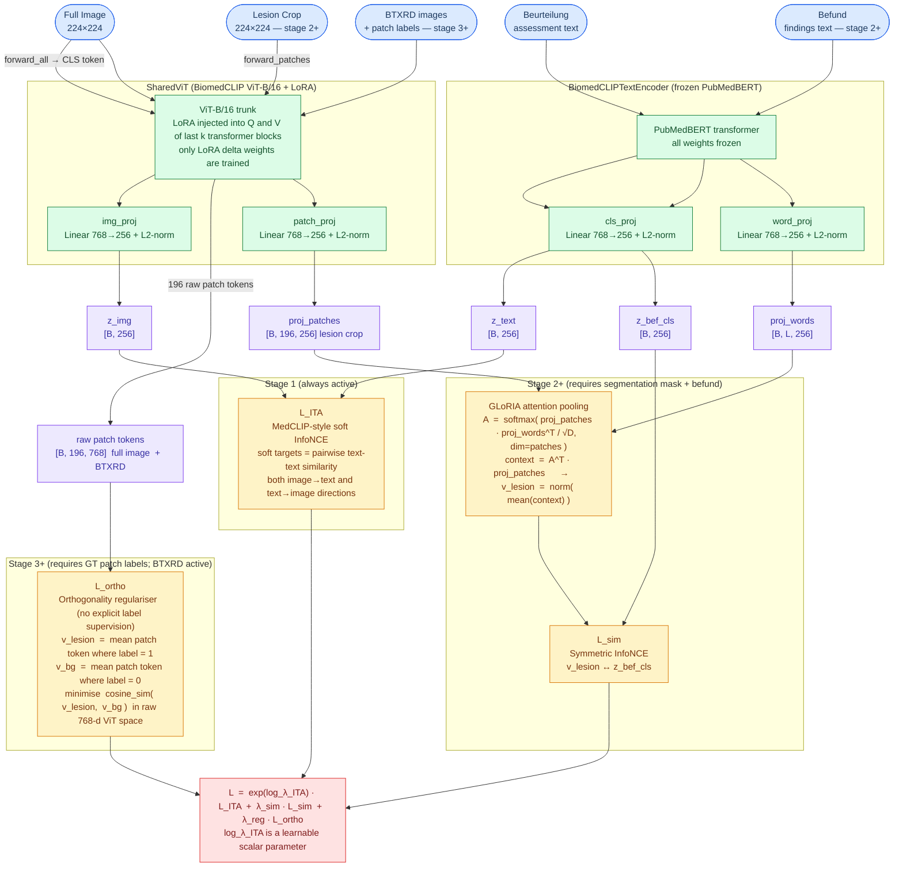
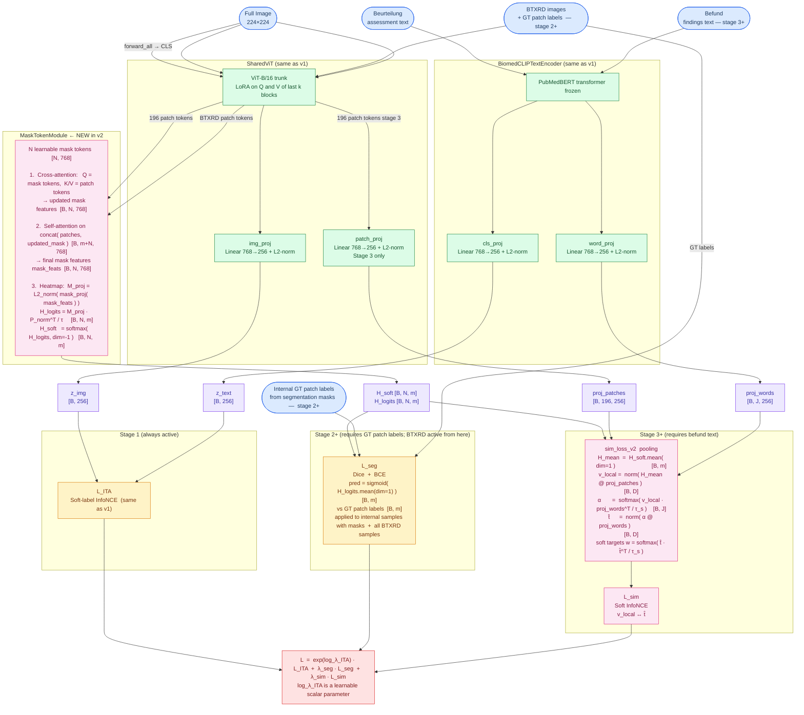

# LACE Architecture Diagrams

## Comparison at a Glance

| | LACE v1 | LACE v2 |
|---|---|---|
| **Stage 1** | L_ITA | L_ITA |
| **Stage 2** | L_ITA + L_sim | L_ITA + L_seg |
| **Stage 3** | L_ITA + L_sim + L_ortho | L_ITA + L_seg + L_sim |
| **Image inputs** | Full image + explicit lesion crop | Full image only |
| **Local alignment** | GLoRIA attn pool on crop patches ↔ befund words | Heatmap-guided pool on full patches ↔ befund tokens |
| **Structural loss** | L_ortho — cosine-sim regulariser (no labels) | L_seg — Dice+BCE vs GT patch labels |
| **BTXRD active from** | Stage 3 | Stage 2 |
| **Extra module** | — | MaskTokenModule |

---

## LACE v1 — `src/LACE/train/pretrain.py`

Three-stage curriculum: **L_ITA → L_ITA + L_sim → L_ITA + L_sim + L_ortho**



---

## LACE v2 — `src/LACE/train/pretrain_v2.py`

Three-stage curriculum: **L_ITA → L_ITA + L_seg → L_ITA + L_seg + L_sim**

Key change: replaces the explicit lesion crop + L_ortho with a learnable **MaskTokenModule** that learns spatial heatmaps under explicit segmentation supervision (L_seg), then uses those heatmaps for local phrase alignment (L_sim).



---

## Key Architectural Differences

### Local alignment strategy

| | LACE v1 | LACE v2 |
|---|---|---|
| **How lesion region is identified** | Explicit crop from segmentation mask (separate ViT forward pass) | MaskTokenModule learns spatial heatmaps H_soft supervised by GT labels |
| **Patch pool for L_sim** | `patch_proj(crop_patches)` — projection of lesion-crop patch tokens | `H_mean @ patch_proj(full_patches)` — heatmap-weighted sum of full-image patch tokens |
| **Text representation for L_sim** | GLoRIA: attn over befund word tokens → context vectors → v_lesion | Phrase attention: v_local attends over befund tokens → t̂ |
| **Contrastive pair** | v_lesion ↔ z_bef_cls | v_local ↔ t̂ |

### MaskTokenModule internals (v2 only)

```
patch_tokens [B, 196, 768]
        │
        ▼  Cross-Attention  (Q = N mask tokens,  K/V = patch tokens)
updated_mask [B, N, 768]
        │
        ▼  concat([patch_tokens, updated_mask])  →  Self-Attention
seq      [B, 196+N, 768]   split → mask_feats [B, N, 768]
        │
        ▼  mask_proj + L2-norm  →  cosine sim with L2-normed patch tokens
H_logits [B, N, 196]     ← raw logits, used for L_seg  (Dice + BCE)
H_soft   [B, N, 196]     ← softmax over patches, used for L_sim pooling
```
